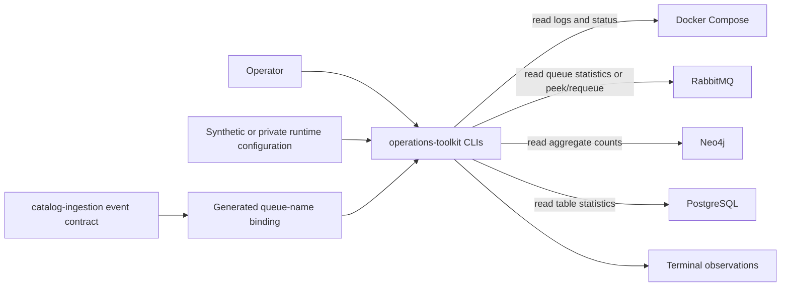

# Architecture

The toolkit is a thin observational layer over standard deployment interfaces. Command modules
format observations for humans; the generated catalog contract owns queue naming; the secret
helper keeps credential values out of arguments and logs.

## Ownership

This repository owns:

- six console commands and their presentation behavior;
- generated catalog-event queue naming helpers;
- the environment/secret-file lookup helper;
- synthetic examples and credential-free tests.

It does not own deployment manifests, hostnames, account provisioning, response procedures,
customer records, or service-specific mutation commands. Those concerns remain outside the
public toolkit.

## Side-effect boundary

Most operations are HTTP GETs, read-only database queries, process inspection, or Docker status
and log reads. `groovemap-debug-message` is the narrow exception: it obtains one delivery and
immediately negatively acknowledges it with requeue enabled. The queue content is retained, but
delivery ordering can change, so its documentation calls out that effect explicitly.
