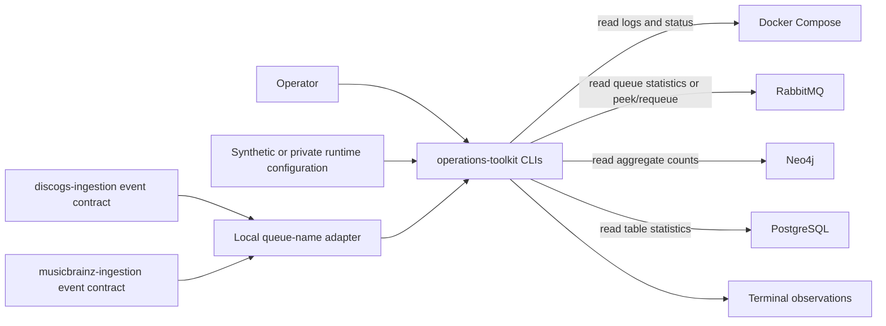

# Architecture

The toolkit is a thin operational layer over standard deployment interfaces. Command modules
format observations for humans; two source-owned producer contracts define queue naming, and a
hand-authored local adapter composes them behind one import. Private transport helpers centralize
bounded RabbitMQ Management GETs and Docker Compose reads, while the secret helper keeps
credential values out of arguments and logs.

## Ownership

This repository owns:

- six console commands and their presentation behavior;
- the local adapter composing both promoted producers' catalog-event queue naming;
- the environment/secret-file lookup helper;
- synthetic examples and credential-free tests.

It does not own deployment manifests, hostnames, account provisioning, response procedures,
customer records, or service-specific mutation commands. Those concerns remain outside the
public toolkit.

[`discogs-ingestion`](https://github.com/groovemap-music/discogs-ingestion) and
[`musicbrainz-ingestion`](https://github.com/groovemap-music/musicbrainz-ingestion) remain the
authorities for their event schemas and generated bindings. This repository records promotion
provenance in source-specific `source.json` files and keeps interpretation in
[`utilities.catalog_contract`](../utilities/catalog_contract.py); promoted generated files are
not imported as the toolkit's shared runtime API.

## Side-effect boundary

Most operations are HTTP GETs, read-only database queries, process inspection, or Docker status
and log reads. `groovemap-debug-message` is the narrow exception: it performs AMQP `basic_get`
with acknowledgements disabled, then immediately sends `basic_nack(requeue=True)` before parsing
the body. The queue content is retained even when parsing fails, but delivery ordering can
change, so its documentation calls out that effect explicitly.
