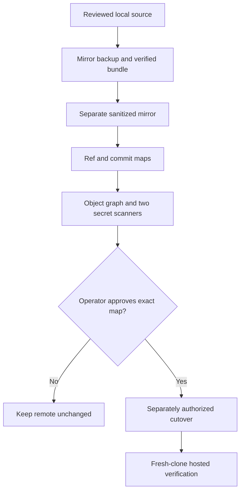

# History rewrite gate

The checked-in procedure prepares evidence; it does not authorize a remote rewrite. It works in
separate mirror clones, preserves a verified pre-rewrite bundle, records every ref and old-to-new
commit mapping, and marks both cutover and public visibility as unapproved.

The sanitized mirror removes private planning paths from every reachable commit:

- `.planning/`
- `docs/superpowers/plans/`
- `docs/superpowers/specs/`

The public architecture, security, extraction, and release documents retain the durable decisions
without carrying raw planning artifacts.



Run the rehearsal only with an absolute, nonexistent private evidence directory:

```bash
export PLANNING_ARCHIVE_REPO=/absolute/path/to/planning-archive
just history-rehearsal /absolute/path/to/operations-toolkit /absolute/new/evidence-directory
```

The private planning archive must contain the prerequisite commit embedded in the script. The
evidence directory is created with owner-only permissions and contains the backup mirror, bundle,
sanitized mirror, ref and commit maps, object graph, verification logs, approval status, and
checksums. Retain it through cutover and rollback.

Before a later cutover, refresh the backup from the remote, record the exact remote ref map and
repository settings, and review any drift. The operator must then approve the exact expected refs,
maintenance window, rollback owner, and retention period. A push, tag, release, visibility change,
or protection change is never performed by the rehearsal.
